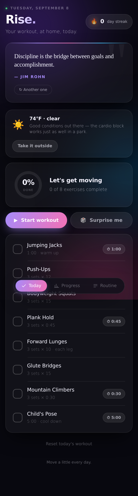
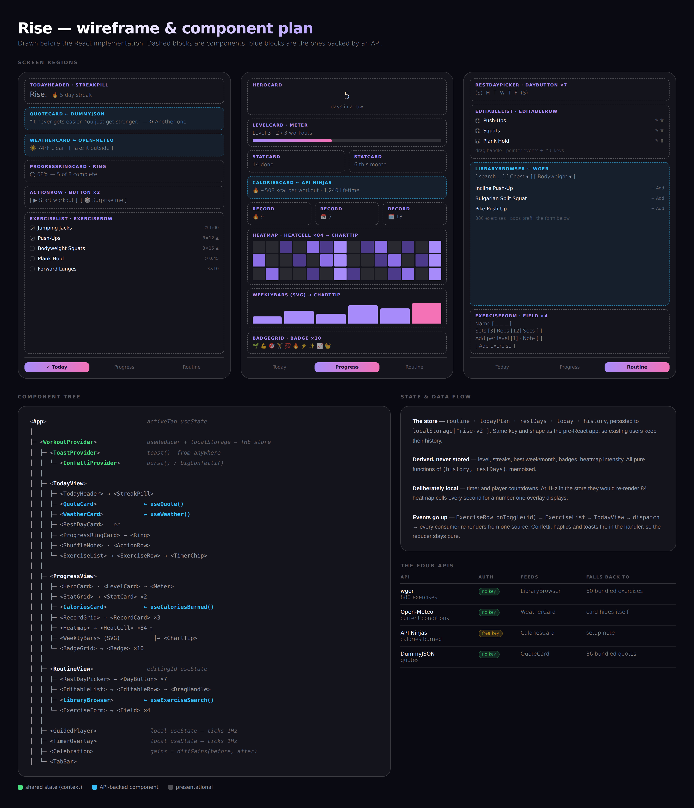

# Rise

A home workout app that adapts to you: it grows your targets as you get stronger,
keeps your streak safe on rest days, walks you through the workout set by set, and
pulls its exercise library, its weather advice, its calorie estimates and its daily
quote from four public APIs.

Built with **React + Vite**. Installable as a PWA and works offline.



---

## The four APIs

| # | API | Auth | What it does in Rise | If it's unavailable |
|---|-----|------|----------------------|---------------------|
| 1 | **[wger](https://wger.de/en/software/api)** | none | The exercise library — search ~880 exercises by muscle group and equipment, and add any of them to your routine | Falls back to Rise's own 60 bundled exercises |
| 2 | **[Open-Meteo](https://open-meteo.com/en/docs)** | none | Reads your local conditions and offers a cardio-and-legs workout outdoors when it's actually nice out | The card hides itself |
| 3 | **[API Ninjas — Calories Burned](https://api-ninjas.com/api/caloriesburned)** | free key | Turns your routine into a calorie estimate per workout and across every workout you've finished | Shows a short setup note |
| 4 | **[DummyJSON — Quotes](https://dummyjson.com/docs/quotes)** | none | The daily quote on the Today tab | Falls back to 36 bundled quotes |

Every API call has a hard timeout and a fallback, because Rise is meant to be
installed on a phone and opened in a garage with one bar of signal. Nothing on
the critical path — ticking exercises, the timer, the guided player, your history
— touches the network at all.

## Features

**Today** — a checklist that remembers, a completion ring, a daily quote, weather-aware
outdoor suggestions, per-exercise timers, and a "surprise me" shuffle that builds a
balanced workout (1 warm-up, 1 cardio, 2 push, 2 legs, 2 core, 1 cool-down) without
touching your saved routine.

**Guided mode** — full-screen, set by set, with 20s rests between sets and 30s between
exercises. Timed moves count themselves down; rep-based moves wait for a tap. Holds a
screen wake lock so your phone doesn't sleep mid-plank.

**Progress** — current and longest streak, a level system where every 3 finished workouts
raises your targets, best week and best month, a 12-week completion heatmap, an 8-week
bar chart, 10 achievement badges, and calorie totals.

**Routine** — build your own list, drag to reorder (or use the arrow keys), set which
weekdays are rest days, and browse the wger library to add new exercises.

**Rest days don't break your streak.** They're part of the programme, not a lapse.

## Run it

```bash
git clone https://github.com/asig98/rise-workout.git
cd rise-workout
npm install
npm run dev
```

Three of the four APIs need no key, so this works immediately. For calorie estimates,
get a free key at [api-ninjas.com](https://api-ninjas.com):

```bash
cp .env.example .env
# then paste your key after VITE_API_NINJAS_KEY=
```

```bash
npm run build     # production build into dist/
npm run preview   # serve the build locally
```

## Tests

A headless smoke test drives the built app in Chromium with all four APIs intercepted,
so both the live paths and the offline fallbacks are covered without depending on four
third-party services being up:

```bash
npm run build
node scripts/smoke.mjs             # 26 checks, APIs mocked
node scripts/smoke.mjs --offline   # 25 checks, every API failing
```

It covers mounting, ticking, the completion ring, the celebration and its badge diff,
persistence across reload, the streak, the heatmap and bar chart, the library browser,
adding from the library, keyboard reordering, and the guided player. Screenshots land
in `scripts/shots/`.

## Wireframe & architecture

The wireframe and component plan were drawn **before** the React implementation:

- **[`documentation/wireframe.png`](documentation/wireframe.png)** — screen regions, the component tree, and the state/data-flow notes at a glance
- **[`documentation/WIREFRAME.md`](documentation/WIREFRAME.md)** — the same thing written out: every component, where state lives, what each child needs, how events travel up



### How state is organised

One `useReducer` store in `WorkoutContext` holds everything that persists:

```js
{
  routine:   [ {id, name, sets, reps, seconds, step, note} ],
  todayPlan: null | [...],              // a shuffle; leaves `routine` untouched
  restDays:  [0],                       // 0 = Sunday
  today:     { date, done: [ids], override },
  history:   { "2026-09-08": { c: 5, t: 8 } }
}
```

It lives at the top because three separate subtrees read and write it: Today ticks
exercises, Routine edits the list, Progress reads the history.

Every stat — level, streaks, best week, badges, heatmap intensity — is **derived** from
`history` and `restDays` by pure functions in `src/lib/stats.js`, never stored. A stat
can't drift out of sync with the ticks that produced it.

Two things are deliberately kept out of the store: the timer countdown and the guided
player's position. Both tick once a second, and in global state that would re-render 84
heatmap cells every second for a number one overlay displays.

### Layout

```
src/
├── App.jsx              tabs, overlays, the workout-completion watcher
├── state/               WorkoutContext · workoutReducer · storage (+ migration)
├── lib/                 stats · dates · exercises · content · feedback
├── api/                 client · wger · openMeteo · apiNinjas · dummyjson
├── hooks/               useQuote · useWeather · useExerciseSearch · useCaloriesBurned
├── components/
│   ├── ui/              Card · Button · Ring · Meter · Field · Toast · Icons
│   ├── today/           TodayView · QuoteCard · WeatherCard · ExerciseList
│   ├── progress/        ProgressView · Heatmap · WeeklyBars · CaloriesCard · ChartTip
│   ├── routine/         RoutineView · EditableList · ExerciseForm · LibraryBrowser
│   └── overlays/        GuidedPlayer · TimerOverlay · Celebration · Confetti
└── styles/global.css
```

## About the port

Rise started as a single 2,025-line `index.html` — vanilla JS, inline styles, no build
step, no APIs. That version is preserved in [`legacy/`](legacy/index.html) for comparison.

This version keeps every feature and the entire visual design, and adds the four API
integrations. Two things were carried over deliberately rather than rewritten:

- **The storage key and shape are unchanged** (`rise-v2`), including the migration code
  that understands the very first save format. Anyone already using Rise keeps their
  full history through the rewrite.
- **The drag-to-reorder maths.** It uses pointer events rather than HTML5 drag-and-drop
  (which does nothing on a touchscreen) and swaps when the dragged row's *leading* edge
  crosses a neighbour's midpoint. In React it needs `flushSync` to measure the new
  position in the same frame it reorders — see the comment in `EditableList.jsx`.

## Deploy

The app is deployed **twice**, from the same `main` branch, and the split is
deliberate.

| Host | URL | Purpose |
|---|---|---|
| **Vercel** | `rise-workout.vercel.app` | The public/submission link. Builds on every push. |
| **GitHub Pages** | `asig98.github.io/rise-workout` | The origin installed PWAs are pinned to. |

Keeping both alive matters for a reason that isn't obvious: `localStorage` is
scoped **per origin**, and every workout, streak and personal record lives
there. Moving the app to a new domain doesn't migrate that data — it silently
starts people over at zero. So the Pages URL stays put for anyone who already
added Rise to their home screen.

### Vercel (automatic)

Import the repo at [vercel.com/new](https://vercel.com/new). Vite is
auto-detected and `vercel.json` is already in the repo, so no configuration is
needed. Set `VITE_API_NINJAS_KEY` in Settings → Environment Variables for
calorie estimates, then redeploy — Vite bakes env vars in at build time.

### GitHub Pages (one command)

Pages has no build step; it serves files exactly as committed. So the built
output is committed to `docs/`:

```bash
npm run build:pages
git add docs && git commit -m "Rebuild Pages bundle" && git push
```

That runs `vite build --base=/rise-workout/ --outDir=docs`, because Pages serves
this repo from a subfolder and every asset URL needs that prefix. The service
worker derives its own base from `self.location`, so one `sw.js` works under
both hosts unmodified.

Repo setting, once: **Settings → Pages → Source: Deploy from a branch →
`main` / `/docs`**.

Re-run that command whenever you want the installed app updated. The Vercel side
needs nothing — it rebuilds from source on every push.

## Licence

Exercise data from [wger](https://wger.de) is CC-BY-SA 4.0. Weather from
[Open-Meteo](https://open-meteo.com) is CC-BY 4.0.
